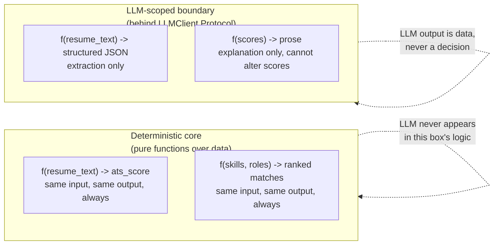
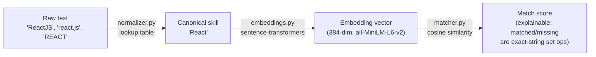

# Abstraction Overview

This document sits above [Architecture](architecture.md) and [HLD](hld.md): instead of describing components, it describes the *abstractions* the system is built from — the boundaries that make it possible to reason about, test, and extend each piece in isolation. Understanding these abstractions is the fastest way to understand why the codebase is organized the way it is.

## 1. The market gap this project targets

Per the SRS (§1.4, §2.1), this project exists because of a specific, named gap in comparable systems:

- **Recruiter-facing AI screening platforms** (HireVue, Eightfold AI, iCIMS) solve a different problem for a different user — employers screening candidates at scale, not a candidate improving their own materials.
- **Academic "resume analyser" projects** typically wrap a single chat-style LLM prompt around the entire task. The result: one pass, no reproducibility (ask twice, get two different scores), no explainability (there's no way to point at *why* a number is what it is), and no mechanism to improve as the job market changes — a limitation explicitly documented in "An AI-Driven Resume Analyser with Job Recommender and Portfolio Code Generator" (IJRASET, April 2026), cited in the SRS as the direct point of comparison.

This system's answer is two abstractions, described below: a **deterministic core / narrow-LLM boundary**, and a **temporal, versioned weight store** instead of a static one.

## 2. Abstraction 1 — The deterministic core / LLM boundary

The entire system can be understood as two kinds of computation, cleanly separated by an interface:

The abstraction boundary is enforced two ways in the actual code, not just by convention:

1. **Module boundary.** `normalizer.py`, `matcher.py`, `ats_score.py`, and `gap_analysis.py` have zero imports of `llm_client.py` or any LLM SDK. `parser.py` and `explainer.py` are the *only* two modules that touch an `LLMClient`.
2. **Interface boundary.** `LLMClient` is a `typing.Protocol` — `parser.py`/`explainer.py` depend on an abstract `.complete(system_prompt, user_prompt) -> str` shape, not on the Groq SDK's concrete types. This is what lets the test suite (`tests/test_pipeline.py`) substitute a `FakeLLMClient` and run fully offline.

**Why this matters as an abstraction, not just an implementation detail:** it means the *cost* of using an LLM (non-determinism, latency, external dependency, price) is paid only for the two tasks that genuinely need natural-language understanding — reading unstructured resume text, and writing readable prose — and never for the tasks that need to be correct, fast, and explainable (scoring, ranking).

## 3. Abstraction 2 — Skills as a normalized, versioned vector space

Rather than treating "skills" as free text everywhere, the system funnels all skill data through one canonical representation before it's ever compared:

Two sub-abstractions stack here:

- **Canonicalization** (`normalizer.py`) collapses spelling/casing variance *before* anything numeric happens, so matched/missing-skill lists stay exact and human-readable rather than "similar-ish embedding distance."
- **Vectorization** (`embeddings.py`) is the only place floating-point, model-dependent computation enters the pipeline — isolated behind two functions (`embed`, `cosine_similarity`) so the underlying model could be swapped without touching `matcher.py`'s ranking logic.

**Temporal extension (planned):** today a role's skill vector is the mean of its (static) curated skill list's embeddings, recomputed fresh each time. The planned `SkillVector` table (see [Database Schema](database-schema.md)) turns this into a **versioned, time-decayed store** — each role's weight vector persists across requests and updates via EMA (`new_weight = α·new_signal + (1−α)·old_weight`) as new market data or feedback arrives, with every prior version retained. This is the abstraction that makes matching improve over time instead of staying frozen at whatever the curated dataset looked like on day one.

## 4. Abstraction 3 — Layered request handling

Standard three-tier separation, but worth stating explicitly since it's what keeps the ML service testable without a running server or database:

| Layer | Knows about | Does not know about |
|---|---|---|
| **Router** (`routers/analyze.py`) | HTTP request/response shapes (Pydantic models), which service to call | How any service computes its result |
| **Service** (`services/*.py`) | Its one job (parse, normalize, match, score, explain) | HTTP, FastAPI, request/response wrapping |
| **Schema** (`models/schemas.py`) | Field names, types, defaults — the data contract | Any business logic |
| **Data** (`data/*.json`, planned DB) | Static/persisted values | How they're used |

A consequence worth naming: every service function in `ml-service/app/services/` can be called directly in a test with plain Python values — no FastAPI `TestClient`, no HTTP round-trip required (see how `tests/test_ats_score.py`, `test_matcher.py`, `test_normalizer.py` all import and call service functions directly).

## 5. Where the abstractions end and the roadmap begins

The abstractions above hold for what's built (`ml-service/`). Two things are explicitly deferred, and knowing this boundary matters for anyone extending the system:

- **Persistence abstraction:** there is currently no repository/DAO layer — `normalizer.py` and `matcher.py` read JSON files directly via `DATA_DIR`. Once the backend exists, this should move behind a repository interface so the ML service can read from PostgreSQL without its callers changing.
- **Orchestration abstraction:** today, `routers/analyze.py` *is* the orchestrator — it calls all five services directly in sequence. Once the Spring Boot backend exists, orchestration for anything involving persistence (resume versioning, recommendation storage, feedback-linked EMA updates) moves there, and the ML service becomes a stateless computation service the backend calls into — exactly matching the deployment view in [Architecture §4](architecture.md#4-deployment-view-demonstration-target).

## Related documents

- [System Architecture](architecture.md)
- [High-Level Design](hld.md)
- [UML Diagrams](uml-diagrams.md)
- [Entities & Fields](entities-and-fields.md)
