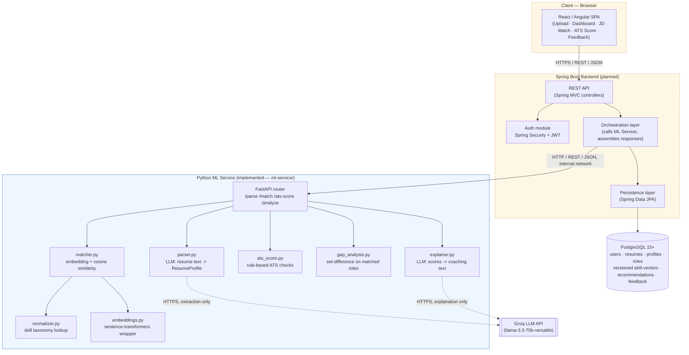
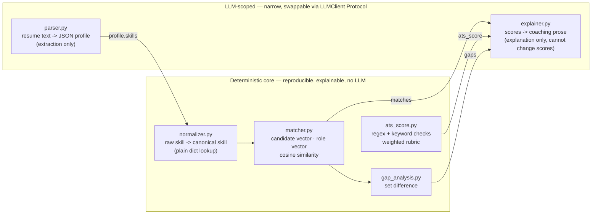
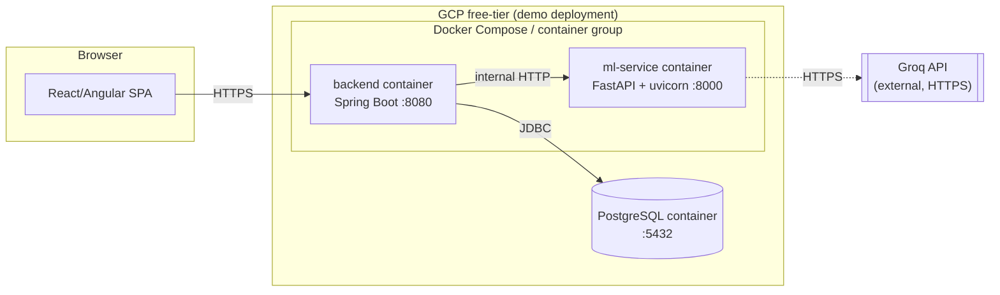

# System Architecture

> Project: **Intelligent Resume Analyser and Career Recommendation System**
> Scope: candidate-facing web app that parses resumes, recommends career roles, scores ATS compatibility, and explains results — with a small, explainable core and a deliberately narrow LLM footprint.

## 1. Why this architecture

The market gap this project targets (see [Abstraction Overview](abstraction-overview.md)) is that most "AI resume analyser" projects wrap a single chat-style LLM prompt around the whole problem: parsing, scoring, matching, and explaining all happen inside one LLM call. That makes the result unreproducible (the same resume can score differently on two runs), unexplainable (there's no line-item breakdown of *why* a score is what it is), and static (matching logic never improves from new data).

This system is built the opposite way: a **deterministic core** does all scoring, normalization, and matching with plain code (regex, a lookup table, cosine similarity over embeddings). The LLM is used for exactly two narrowly-scoped tasks — extracting structured fields from raw resume text, and turning already-computed numbers into a readable paragraph. The LLM never decides a score or a ranking.

## 2. Component diagram (target architecture)

The system is designed as three deployable components. As of this writing, the **ML Service** is implemented and tested; the **Backend** and **Frontend** are planned (see [Tech Stack](tech-stack.md) for build status per layer).

Dashed borders mark components that are **planned, not yet implemented** — see the [Tech Stack](tech-stack.md) build-status table. Everything inside the "ML Service" box exists today, one Python module per box, matching `ml-service/app/`.

## 3. The deterministic-core / narrow-LLM split

This is the single most important architectural decision in the system, so it gets its own diagram. Two request paths through the ML service never touch the LLM at all:

Two properties fall out of this split directly:

- **Reproducibility.** Given the same resume text and the same skill taxonomy/role dataset, `normalizer.py`, `matcher.py`, `ats_score.py`, and `gap_analysis.py` always return the same numbers — there's no sampling, no temperature, no model version drift affecting the score itself.
- **Graceful degradation** (NFR-3.1 in the SRS): if the Groq API is down, `/match` and `/ats-score` keep working; only `/parse` (structured extraction) and the `explanation` field of `/analyze` are affected.

## 4. Deployment view (demonstration target)

Per the SRS design constraints (§2.5), the demo deployment targets free-tier cloud resources with Docker containers — no managed Kubernetes, no autoscaling group. The backend is designed stateless (NFR-4.1) so it can be horizontally scaled later without an architecture change.

## 5. Data flow at a glance

Full breakdown in [DFD](dfd.md); summarized here as the request lifecycle for the primary `/analyze` endpoint:

1. Client uploads a resume (backend, planned) or submits raw text (`ml-service` today).
2. `parser.py` calls the Groq LLM once to turn text into a `ResumeProfile`.
3. `normalizer.py` maps every extracted skill to its canonical form via the skill taxonomy.
4. `matcher.py` embeds the normalized skill set and every curated role's skill set (`sentence-transformers`, model `all-MiniLM-L6-v2`), ranks roles by cosine similarity, and returns matched/missing skills per role.
5. `ats_score.py` runs independently over the raw resume text (rule-based, no dependency on parsing).
6. `gap_analysis.py` derives skill gaps directly from the matcher's `missing_skills`.
7. `explainer.py` calls the Groq LLM a second time, strictly to turn the five outputs above into 2–4 coaching paragraphs — it cannot alter any number already computed.
8. The backend (planned) persists the resume version, parsed profile, and recommendation rows, and — on user feedback — feeds an exponential-moving-average update into the versioned `SkillVector` table (see [Database Schema](database-schema.md) §Temporal skill-vector store).

## Related documents

- [High-Level Design](hld.md) — layer responsibilities and key design decisions
- [Low-Level Design](lld.md) — module design, API contracts, sequence diagrams
- [Data Flow Diagram](dfd.md) — Level 0/1 DFD
- [Process Flow](process-flow.md) — end-to-end request flows
- [Abstraction Overview](abstraction-overview.md) — why the deterministic/LLM boundary exists
- [Tech Stack](tech-stack.md) — per-layer technology and build status
