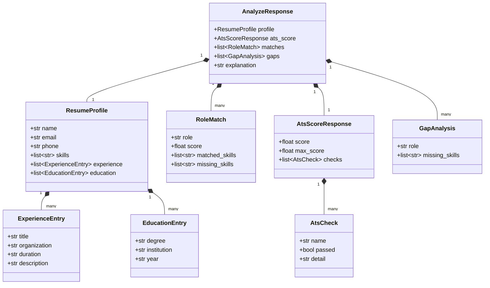
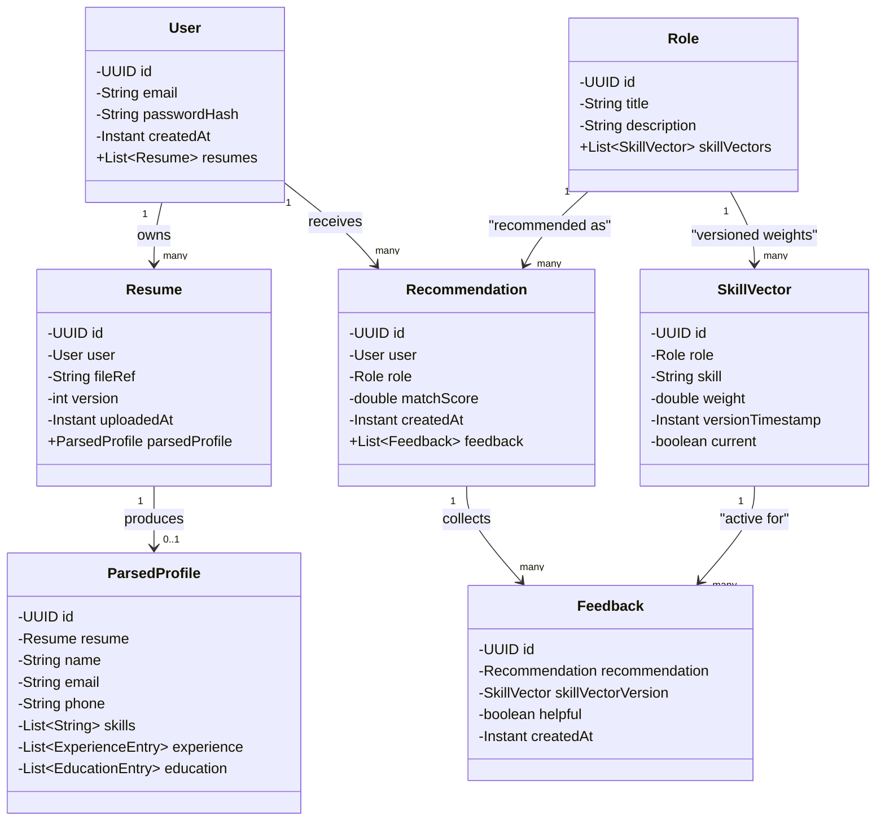

# Class Diagram

Two diagrams: the **implemented** ML-service classes (Pydantic models + service functions, shown as static-method classes for UML purposes since Python modules of free functions don't map 1:1 to UML classes) and the **planned** backend JPA entity classes. Full source for every class shown here is in [Entities & Fields](entities-and-fields.md).

## 1. Implemented — ML Service (`ml-service/app/`)

### 1.1 Data classes (Pydantic models, `models/schemas.py`)

*(Request-only models — `ParseRequest`, `MatchRequest`, `AtsScoreRequest`, `AnalyzeRequest` — are omitted from the diagram for readability; see [Entities & Fields](entities-and-fields.md) for their full field lists.)*

### 1.2 Service classes (behavioral view of `services/*.py`)

Python implements these as modules of functions, not classes — shown here as UML classes with static-style operations, which is the standard way to diagram a functional module.

```mermaid
classDiagram
    class LLMClient {
        <<Protocol>>
        +complete(system_prompt, user_prompt) str
    }
    class GroqLLMClient {
        -Groq _client
        -str _model
        +complete(system_prompt, user_prompt) str
    }
    class GeminiLLMClient {
        -Client _client
        -str _model
        +complete(system_prompt, user_prompt) str
    }
    class DocumentTextExtractor {
        <<Protocol>>
        +extract(file_bytes) str
    }
    class PdfTextExtractor {
        <<pdf_extractor.py>>
        +extract(file_bytes) str
    }
    class ResumeParser {
        <<parser.py>>
        +parse_resume(resume_text, client) ResumeProfile
    }
    class LocalNerResumeParser {
        <<local_ner_parser.py>>
        +parse_resume_local(resume_text, ner_pipeline) ResumeProfile
    }
    class SkillNormalizer {
        <<normalizer.py>>
        +normalize_skill(raw_skill) str
        +normalize_skills(raw_skills) list~str~
    }
    class EmbeddingService {
        <<embeddings.py>>
        +embed(texts) ndarray
        +cosine_similarity(a, b) float
    }
    class RoleMatcher {
        <<matcher.py>>
        +match_roles(raw_skills, top_n) list~RoleMatch~
    }
    class AtsScorer {
        <<ats_score.py>>
        +score_resume(resume_text, target_keywords) AtsScoreResponse
    }
    class GapAnalyzer {
        <<gap_analysis.py>>
        +analyze_gaps(matches) list~GapAnalysis~
    }
    class ResultExplainer {
        <<explainer.py>>
        +explain_results(profile, ats_score, matches, gaps, client) str
    }

    GroqLLMClient ..|> LLMClient
    GeminiLLMClient ..|> LLMClient
    PdfTextExtractor ..|> DocumentTextExtractor
    ResumeParser --> LocalNerResumeParser : uses (default)
    ResumeParser --> LLMClient : uses (opt-in, PARSER_BACKEND=llm)
    ResultExplainer --> LLMClient : uses
    RoleMatcher --> SkillNormalizer : uses
    RoleMatcher --> EmbeddingService : uses
    ResumeParser --> ResumeProfile : returns
    LocalNerResumeParser --> ResumeProfile : returns
    RoleMatcher --> RoleMatch : returns
    AtsScorer --> AtsScoreResponse : returns
    GapAnalyzer --> GapAnalysis : returns
```

## 2. Planned — Backend JPA entities

Object-oriented view of [Entity Diagram](entity-diagram.md) / [Database Schema](database-schema.md), as it will look once implemented in the Spring Boot backend.

## Related documents

- [Entity Diagram](entity-diagram.md)
- [Entities & Fields](entities-and-fields.md) — full source code for every class above
- [LLD](lld.md)
