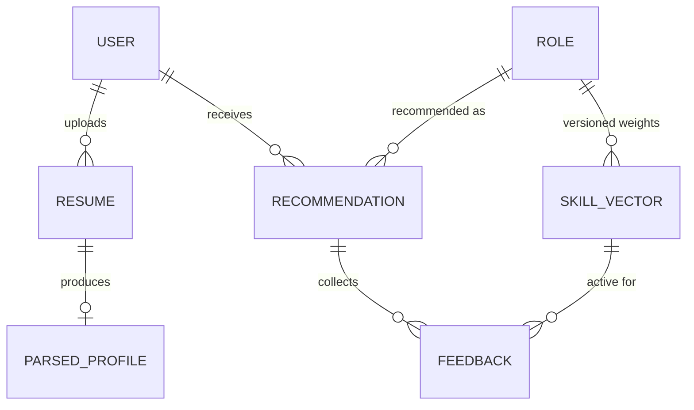

# Database Schema

Physical design for the planned PostgreSQL 15+ store (SRS §4.3, Table 3). Builds directly on [Entity Diagram](entity-diagram.md) §Diagram. All DDL below is **indicative** — the SRS explicitly tracks detailed schema (types, constraints, indices) as a separate implementation task (§7); this document is that task's starting point, kept consistent with the Pydantic shapes already implemented in `ml-service/`.

## 1. ER diagram

See [Entity Diagram](entity-diagram.md) for the full diagram; repeated here for quick reference alongside the DDL.



## 2. Indicative DDL

```sql
-- Extension for gen_random_uuid(); PostgreSQL 13+ built-in via pgcrypto, or use uuid-ossp
CREATE EXTENSION IF NOT EXISTS pgcrypto;

-- ────────────────────────────────────────────────────────────────
-- Users & authentication  (NFR-2.1, NFR-2.2)
-- ────────────────────────────────────────────────────────────────
CREATE TABLE users (
    id              UUID PRIMARY KEY DEFAULT gen_random_uuid(),
    email           VARCHAR(320) NOT NULL UNIQUE,
    password_hash   VARCHAR(255) NOT NULL,        -- bcrypt, never plaintext (NFR-2.2)
    role            VARCHAR(20) NOT NULL DEFAULT 'USER',  -- USER | PREMIUM_USER | ADMIN (RBAC)
    created_at      TIMESTAMPTZ NOT NULL DEFAULT now()
);

-- ────────────────────────────────────────────────────────────────
-- Resumes — one row per uploaded VERSION, never overwritten (FR-1.5)
-- ────────────────────────────────────────────────────────────────
CREATE TABLE resumes (
    id              UUID PRIMARY KEY DEFAULT gen_random_uuid(),
    user_id         UUID NOT NULL REFERENCES users(id) ON DELETE CASCADE,
    file_ref        TEXT NOT NULL,                 -- object-storage key/URL, not the file itself
    version         INTEGER NOT NULL,               -- monotonically increasing per user
    uploaded_at     TIMESTAMPTZ NOT NULL DEFAULT now(),
    UNIQUE (user_id, version)
);
CREATE INDEX idx_resumes_user_id ON resumes (user_id);

-- ────────────────────────────────────────────────────────────────
-- Parsed profiles — structured extraction output (FR-1.2), 1:1 with a resume version
-- Mirrors ResumeProfile / ExperienceEntry / EducationEntry in ml-service/app/models/schemas.py
-- ────────────────────────────────────────────────────────────────
CREATE TABLE parsed_profiles (
    id              UUID PRIMARY KEY DEFAULT gen_random_uuid(),
    resume_id       UUID NOT NULL UNIQUE REFERENCES resumes(id) ON DELETE CASCADE,
    name            VARCHAR(255) NOT NULL DEFAULT '',
    email           VARCHAR(320) NOT NULL DEFAULT '',
    phone           VARCHAR(50)  NOT NULL DEFAULT '',
    skills          JSONB NOT NULL DEFAULT '[]',    -- string[]
    experience      JSONB NOT NULL DEFAULT '[]',    -- ExperienceEntry[]
    education       JSONB NOT NULL DEFAULT '[]',    -- EducationEntry[]
    created_at      TIMESTAMPTZ NOT NULL DEFAULT now()
);
CREATE INDEX idx_parsed_profiles_skills_gin ON parsed_profiles USING GIN (skills);

-- ────────────────────────────────────────────────────────────────
-- Curated job roles — replaces the static role_skills.json once the backend exists
-- ────────────────────────────────────────────────────────────────
CREATE TABLE roles (
    id              UUID PRIMARY KEY DEFAULT gen_random_uuid(),
    title           VARCHAR(255) NOT NULL UNIQUE,
    description     TEXT NOT NULL DEFAULT ''
);

-- ────────────────────────────────────────────────────────────────
-- Versioned, EMA-updated skill-vector store (FR-7.1–FR-7.4) — the
-- direct implementation of the "temporal update" mechanism.
-- Every update INSERTs a new version rather than UPDATE-ing in place,
-- so prior versions are preserved for auditability (FR-7.4).
-- ────────────────────────────────────────────────────────────────
CREATE TABLE skill_vectors (
    id                  UUID PRIMARY KEY DEFAULT gen_random_uuid(),
    role_id             UUID NOT NULL REFERENCES roles(id) ON DELETE CASCADE,
    skill               VARCHAR(255) NOT NULL,       -- canonical skill name (matches skill_taxonomy.json keys)
    weight              DOUBLE PRECISION NOT NULL,   -- EMA-updated weight, 0.0–1.0 range by convention
    version_timestamp   TIMESTAMPTZ NOT NULL DEFAULT now(),
    is_current          BOOLEAN NOT NULL DEFAULT true,  -- fast lookup of the active version per (role, skill)
    UNIQUE (role_id, skill, version_timestamp)
);
CREATE INDEX idx_skill_vectors_current ON skill_vectors (role_id, skill) WHERE is_current;

-- ────────────────────────────────────────────────────────────────
-- Recommendations — one row per (user, role) match at analysis time
-- ────────────────────────────────────────────────────────────────
CREATE TABLE recommendations (
    id              UUID PRIMARY KEY DEFAULT gen_random_uuid(),
    user_id         UUID NOT NULL REFERENCES users(id) ON DELETE CASCADE,
    role_id         UUID NOT NULL REFERENCES roles(id) ON DELETE CASCADE,
    match_score     DOUBLE PRECISION NOT NULL,       -- cosine similarity, 0.0–1.0 (RoleMatch.score)
    created_at      TIMESTAMPTZ NOT NULL DEFAULT now()
);
CREATE INDEX idx_recommendations_user_id ON recommendations (user_id, created_at DESC);

-- ────────────────────────────────────────────────────────────────
-- Feedback — the signal that feeds the EMA update (FR-7.3, FR-10.1, FR-10.2)
-- Explicitly links to BOTH the recommendation and the skill-vector
-- version that was active when the feedback was given.
-- ────────────────────────────────────────────────────────────────
CREATE TABLE feedback (
    id                          UUID PRIMARY KEY DEFAULT gen_random_uuid(),
    recommendation_id           UUID NOT NULL REFERENCES recommendations(id) ON DELETE CASCADE,
    skill_vector_version_id     UUID REFERENCES skill_vectors(id) ON DELETE SET NULL,
    is_helpful                  BOOLEAN NOT NULL,
    created_at                  TIMESTAMPTZ NOT NULL DEFAULT now()
);
CREATE INDEX idx_feedback_recommendation_id ON feedback (recommendation_id);
```

## 3. The EMA update, expressed against this schema

FR-7.2's formula: `new_weight = α × new_signal + (1 − α) × old_weight`. Against the tables above, one update cycle is:

```sql
-- 1. Read the current weight for (role, skill)
SELECT weight FROM skill_vectors
WHERE role_id = :role_id AND skill = :skill AND is_current
LIMIT 1;

-- 2. Compute new_signal application-side (from aggregated Feedback.is_helpful
--    plus any ingested job-market data — the SRS leaves the market-data
--    ingestion source as a post-MVP concern), then:

-- 3. Retire the old version and insert the new one, atomically
BEGIN;
UPDATE skill_vectors SET is_current = false
WHERE role_id = :role_id AND skill = :skill AND is_current;

INSERT INTO skill_vectors (role_id, skill, weight, version_timestamp, is_current)
VALUES (:role_id, :skill, :new_weight, now(), true);
COMMIT;
```

This keeps every historical weight queryable (`SELECT * FROM skill_vectors WHERE role_id = ... ORDER BY version_timestamp`) for the trend reporting FR-7.4 requires, while `idx_skill_vectors_current` keeps the hot-path lookup (current weight, used by every `/match` call) fast.

## 4. Mapping to the implemented ML service today

The ML service does not talk to PostgreSQL yet — `roles` (title only, no description) live in `role_skills.json`, and `skill_vectors.weight` doesn't exist yet as a concept: `matcher.py` currently treats every skill in a role's list as equally weighted (implicit weight = 1) when computing the mean embedding vector. Migrating `matcher._load_roles()` to read from `roles`/`skill_vectors` (weighted mean instead of plain mean) is the concrete, minimal change that turns the static matcher into the temporal one described in SRS §3.7 — see [Process Flow §4](process-flow.md#4-planned-flow--feedback--temporal-ema-skill-vector-update).

## Related documents

- [Entity Diagram](entity-diagram.md)
- [Entities & Fields](entities-and-fields.md) — ORM entity code for these tables
- [LLD](lld.md)
