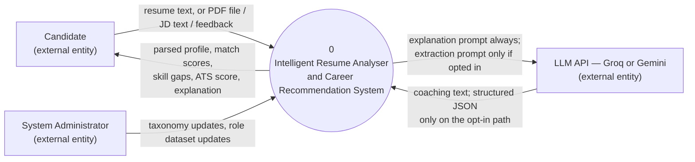

# Data Flow Diagram (DFD)

Standard Gane–Sarson style: rounded rectangles are processes, open-ended rectangles are external entities, parallel lines are data stores. Level 0 gives the system boundary; Level 1 decomposes the one process that matters most — resume analysis — into the actual pipeline stages implemented in `ml-service/`.

## Level 0 — Context diagram



## Level 1 — Decomposition of process 0 (the analyze pipeline)

This is the actual data flow inside `POST /analyze`, one bubble per service module.

```mermaid
flowchart TB
    Candidate["Candidate"]
    LLM["LLM API — Groq or Gemini"]

    P0(("0.5\nExtract Text from\nUploaded PDF\n(upload.py, document_extraction/)"))
    P1(("1.0\nParse Resume\n(parser.py -> local_ner_parser.py\nby default; LLM if opted in)"))
    P2(("2.0\nNormalize Skills\n(normalizer.py)"))
    P3(("3.0\nEmbed & Match Roles\n(matcher.py, embeddings.py)"))
    P4(("4.0\nScore ATS\nCompatibility\n(ats_score.py)"))
    P5(("5.0\nAnalyze Skill Gaps\n(gap_analysis.py)"))
    P6(("6.0\nGenerate Explanation\n(explainer.py)"))

    D1[("D1: Skill Taxonomy\nskill_taxonomy.json")]
    D2[("D2: Curated Role Dataset\nrole_skills.json")]

    Candidate -->|PDF file| P0
    P0 -->|resume_text\n(column-aware reading order)| P1
    Candidate -->|resume_text| P1
    Candidate -->|resume_text, target_keywords| P4
    P1 -.->|extraction prompt, opt-in only| LLM
    LLM -.->|raw JSON, opt-in only| P1
    P1 -->|ResumeProfile\n(name, contact, skills[],\nexperience[], education[])| P2
    P2 <-->|variant -> canonical lookup| D1
    P2 -->|normalized skills[]| P3
    P3 <-->|role skill lists| D2
    P3 -->|RoleMatch[]\n(role, score, matched, missing)| P5
    P3 -->|RoleMatch[]| P6
    P4 -->|AtsScoreResponse\n(score, max_score, checks[])| P6
    P5 -->|GapAnalysis[]\n(role, missing_skills)| P6
    P1 -->|ResumeProfile| P6
    P6 -->|explanation prompt| LLM
    LLM -->|coaching text| P6
    P6 -->|AnalyzeResponse\n(profile, ats_score,\nmatches, gaps, explanation)| Candidate
```

## Level 1 — Planned backend data flow (once implemented)

Adds persistence and the temporal feedback loop around the ML-service pipeline above.

```mermaid
flowchart TB
    Candidate["Candidate"]
    MLPipeline(("0.0\nResume Analysis Pipeline\n(see diagram above)"))
    P7(("7.0\nPersist Resume Version\n& Recommendations"))
    P8(("8.0\nCollect Feedback"))
    P9(("9.0\nUpdate Skill-Vector\nWeights (EMA)"))

    D3[("D3: Resume & Profile Store\n(PostgreSQL: Resume, ParsedProfile)")]
    D4[("D4: Recommendation Store\n(PostgreSQL: Recommendation)")]
    D5[("D5: Versioned Skill-Vector Store\n(PostgreSQL: SkillVector)")]
    D6[("D6: Feedback Store\n(PostgreSQL: Feedback)")]

    Candidate -->|upload resume| P7
    P7 -->|resume_text| MLPipeline
    MLPipeline -->|AnalyzeResponse| P7
    P7 --> D3
    P7 --> D4
    Candidate -->|helpful / not helpful| P8
    P8 --> D6
    P8 -->|feedback signal| P9
    D5 <--> P9
    P9 -->|new_weight = α·signal + (1-α)·old_weight| D5
```

## Notes

- Data stores `D1`/`D2` are flat JSON files today (`ml-service/app/data/`); FR-2.3 requires the taxonomy be admin-extensible without a code deployment, which implies these move to `D5`-style DB-backed, versioned stores once the backend exists.
- `D5` (versioned skill-vector store) is the direct implementation of SRS §3.7 (Temporal Skill-Vector Update Mechanism) — see [Database Schema](database-schema.md) for its column design and [Process Flow](process-flow.md) for the EMA update as a step-by-step sequence.

## Related documents

- [Use Case Diagram](use-case-diagram.md)
- [Process Flow](process-flow.md)
- [Entity Diagram](entity-diagram.md)
