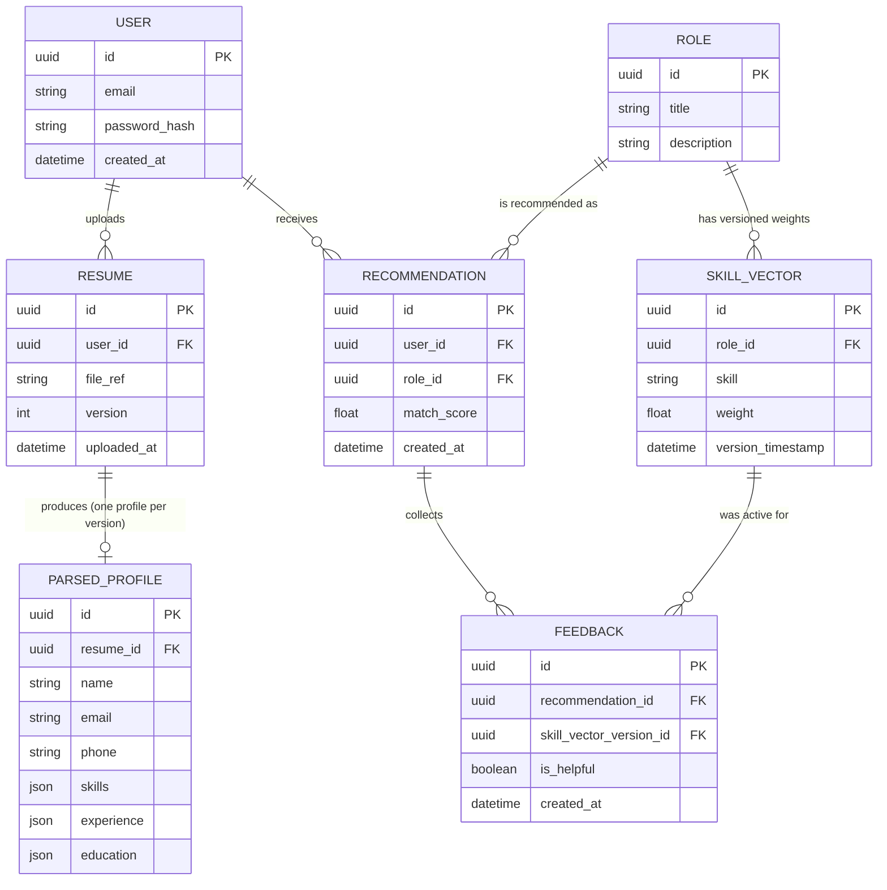

# Entity Diagram (Conceptual / Logical)

Source: SRS §7 ("Data Requirements") entity table, extended with cardinalities and the relationships implied by the functional requirements (FR-1.5 versioning, FR-7.1–7.4 versioned skill vectors, FR-10.2 feedback linked to a specific recommendation *and* skill-vector version). This is the conceptual model; see [Database Schema](database-schema.md) for the physical column-level design (types, constraints, indices) and indicative DDL.

## Diagram

## Relationship notes

| Relationship | Cardinality | Why |
|---|---|---|
| User → Resume | 1 : N | FR-1.5 — every upload is a new, distinct, timestamped version; never overwritten. |
| Resume → ParsedProfile | 1 : 0..1 | Each resume version is parsed into exactly one structured profile (`ParseResponse.profile` in the implemented ML service). |
| User → Recommendation | 1 : N | A user accumulates one recommendation row per matched role per analysis run (FR-3.4: recomputed on every new resume version). |
| Role → Recommendation | 1 : N | A role can be recommended to many users over time. |
| Role → SkillVector | 1 : N | Versioned weight store — one row per (role, skill, version_timestamp) per FR-7.1/FR-7.4 (prior versions retained, never overwritten). |
| Recommendation → Feedback | 1 : N | A candidate can leave feedback on a recommendation (FR-10.1); modeled as 1:N to allow correction, though the primary flow is one feedback event per recommendation. |
| SkillVector → Feedback | 1 : N | FR-10.2 requires feedback be linked to "the specific recommendation **and** role-vector version active at the time it was given" — this is what makes the EMA update auditable. |

## What's implemented vs. modeled-only

None of this schema is implemented yet — the ML service currently reads its role/skill data from two flat JSON files (`role_skills.json`, `skill_taxonomy.json`), not from `Role`/`SkillVector` tables. This diagram is the target data model for the planned backend + PostgreSQL layer. See [Abstraction Overview §5](abstraction-overview.md#5-where-the-abstractions-end-and-the-roadmap-begins) for why that boundary is intentional at this stage.

The `ParsedProfile.skills` / `experience` / `education` fields are modeled as `json` (PostgreSQL `jsonb`) rather than normalized child tables — this mirrors the actual implemented Pydantic shape (`ResumeProfile.skills: list[str]`, `.experience: list[ExperienceEntry]`, `.education: list[EducationEntry]` in `ml-service/app/models/schemas.py`) and keeps the write path simple for an MVP. Normalizing `experience`/`education` into their own tables is a reasonable post-MVP refinement if the dashboard ever needs to query into individual experience entries.

## Related documents

- [Database Schema](database-schema.md) — DDL, types, constraints, indices
- [Class Diagram](class-diagram.md) — object-oriented view of the same data
- [Entities & Fields](entities-and-fields.md) — actual code for every entity/model
