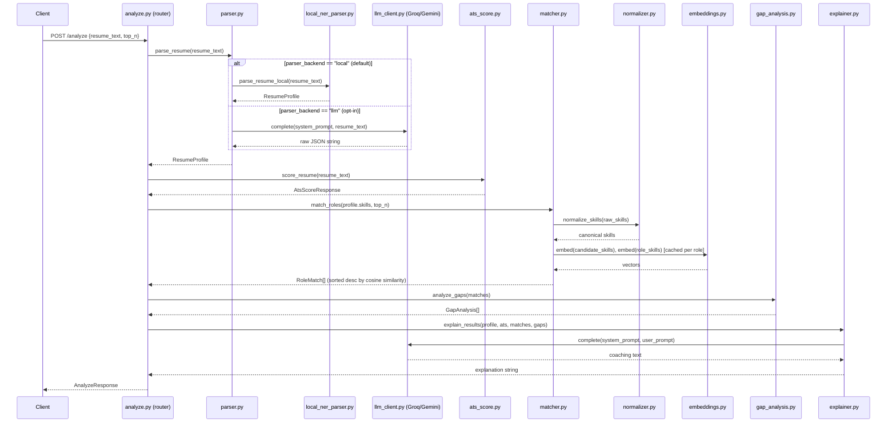

# Low-Level Design (LLD)

Module-level design for the **ML Service** (`ml-service/`, implemented) plus the Backend API surface it sits behind (`backend/`, also implemented — see §7.3). This is the most implementation-grounded document in the set — every schema and function signature below matches the current code in `ml-service/app/` and `backend/src/main/java/`.

## 1. Module map

```
ml-service/app/
├── main.py                # FastAPI app, mounts analyze_router + upload_router, GET /health
├── config.py               # Settings (pydantic-settings), .env-backed
├── models/
│   └── schemas.py          # All Pydantic request/response models
├── routers/
│   ├── analyze.py          # POST /parse /match /ats-score /analyze
│   └── upload.py           # POST /parse-file /analyze-file
├── services/
│   ├── parser.py           # text -> ResumeProfile; routes to local NER (default) or LLM
│   ├── local_ner_parser.py # local NER model (yashpwr/resume-ner-bert-v2), chunking + entity clustering
│   ├── normalizer.py       # skill string -> canonical skill
│   ├── embeddings.py       # sentence-transformers wrapper
│   ├── matcher.py          # embedding + cosine-similarity role ranking
│   ├── ats_score.py        # rule-based ATS scoring
│   ├── gap_analysis.py     # missing-skill derivation
│   ├── explainer.py        # LLM: scores -> coaching prose
│   ├── llm_client.py       # LLMClient Protocol + GroqLLMClient / GeminiLLMClient
│   └── document_extraction/
│       ├── base.py         # DocumentTextExtractor Protocol + UnsupportedDocumentTypeError
│       ├── pdf_extractor.py# PdfTextExtractor (pdfplumber, column-aware reordering)
│       └── registry.py     # file extension -> DocumentTextExtractor
└── data/
    ├── skill_taxonomy.json # canonical -> [variants]
    └── role_skills.json    # [{role, skills[]}, ...] curated dataset
```

## 2. API contracts (implemented)

All endpoints are mounted with no path prefix (`app.include_router(analyze_router)`, `app.include_router(upload_router)`), so paths are exactly as shown.

### `POST /parse`
Extracts a structured profile from raw resume text. Runs the local NER model by default (`Settings.parser_backend == "local"`); routes through the configured LLM provider instead if `PARSER_BACKEND=llm`.

```jsonc
// Request  — ParseRequest
{ "resume_text": "string" }

// Response — ParseResponse
{
  "profile": {
    "name": "string", "email": "string", "phone": "string",
    "skills": ["string"],
    "experience": [{ "title": "string", "organization": "string", "duration": "string", "description": "string" }],
    "education": [{ "degree": "string", "institution": "string", "year": "string" }]
  }
}
```
Note: on the local (default) backend, `experience[*].description` is always `""` (no NER signal for free-text descriptions — see §6), and `duration` is filled only when a nearby date-range regex match is found.

### `POST /parse-file`
Same as `POST /parse`, but takes an uploaded file instead of raw text. Dispatches to a `DocumentTextExtractor` by file extension (`document_extraction/registry.py`); currently only `.pdf` is registered.

```jsonc
// Request — multipart/form-data, field "file"

// Response — ParseResponse (identical shape to POST /parse)
```
Returns `415` if the uploaded file's extension has no registered extractor (e.g. `.docx`, until a DOCX extractor is added).

### `POST /match`
Ranks curated roles by similarity to a given skill list. No LLM call.

```jsonc
// Request — MatchRequest
{ "skills": ["string"], "top_n": 5 }

// Response — MatchResponse
{
  "matches": [
    { "role": "string", "score": 0.0, "matched_skills": ["string"], "missing_skills": ["string"] }
  ]
}
```
`matches` is sorted descending by `score` (cosine similarity, rounded to 4 decimals) and truncated to `top_n`.

### `POST /ats-score`
Rule-based ATS compatibility score. No LLM call.

```jsonc
// Request — AtsScoreRequest
{ "resume_text": "string", "target_keywords": ["string"] }

// Response — AtsScoreResponse
{
  "score": 0.0, "max_score": 100.0,
  "checks": [ { "name": "string", "passed": true, "detail": "string" } ]
}
```
`max_score` is `90.0` (sum of `BASE_CHECK_WEIGHTS`) plus `20.0` more (`KEYWORD_WEIGHT`) only when `target_keywords` is non-empty — so `max_score` is not a fixed constant; clients must read it from the response.

### `POST /analyze`
Full pipeline in one call: parse → ATS score → match → gap analysis → explain.

```jsonc
// Request — AnalyzeRequest
{ "resume_text": "string", "top_n": 3 }

// Response — AnalyzeResponse
{
  "profile": { /* ResumeProfile */ },
  "ats_score": { /* AtsScoreResponse */ },
  "matches": [ /* RoleMatch[] */ ],
  "gaps": [ { "role": "string", "missing_skills": ["string"] } ],
  "explanation": "string"
}
```

### `GET /health`
`{ "status": "ok" }` — liveness probe, no auth, defined directly in `main.py`.

## 3. Sequence diagram — `POST /analyze`



## 4. Matching algorithm (module-level detail)

`matcher.match_roles(raw_skills, top_n)`:

1. `normalize_skills(raw_skills)` — dedupe + canonicalize, order-preserving.
2. `_skill_set_vector(candidate_skills)` — embed each skill string, return the **element-wise mean** of the resulting vectors (a single vector representing the whole skill set). Empty input returns `np.zeros(1)`.
3. For each curated role (`_load_roles()`, `lru_cache`-loaded once from `role_skills.json`, skills pre-normalized at load time):
   - `_role_vector(role_name)` — same mean-of-embeddings approach, `lru_cache`-memoized per role name so repeated calls don't re-embed.
   - `cosine_similarity(candidate_vector, role_vector)` — dot product over the product of L2 norms; returns `0.0` if either vector is zero.
   - `matched_skills` = role skills present in the candidate's normalized set; `missing_skills` = role skills absent from it. Both are plain set-membership checks against `candidate_set`, independent of the similarity score.
4. Sort all scored roles descending by `score`, return the first `top_n`.

**Complexity:** O(R · S) embedding calls avoided via caching (`lru_cache` on `_role_vector`) — a role's vector is computed once per process lifetime, not once per request. Per-request cost is one embedding batch for the candidate's skills plus O(R) cosine-similarity computations, R = number of curated roles (dataset target: 30–50 roles per SRS §2.6, tested up to 100 per NFR-1.2).

## 5. ATS scoring rubric (module-level detail)

`ats_score.score_resume(resume_text, target_keywords)` — every check is independent and additive:

| Check | Weight | Method |
|---|---|---|
| `contact_email` | 15.0 | Regex `[\w.+-]+@[\w-]+\.[\w.-]+` |
| `contact_phone` | 10.0 | Regex `\+?\d[\d\s().-]{8,}\d` |
| `section_experience` | 15.0 | Any of `"experience"`, `"work experience"`, `"employment history"` present (case-insensitive substring) |
| `section_education` | 15.0 | Any of `"education"`, `"academic background"` |
| `section_skills` | 15.0 | Any of `"skills"`, `"technical skills"`, `"core competencies"` |
| `sufficient_length` | 10.0 | Word count ≥ 150 |
| `keyword_coverage` (optional) | 20.0 | Only added to `max_score` when `target_keywords` is non-empty; `passed = (matched / total) >= 0.5`; partial credit awarded proportionally (`earned += 20.0 * coverage`) |

Base `max_score` = 90.0 always; +20.0 only when keywords are supplied. This asymmetry is intentional and is exactly what `test_keyword_coverage_adds_to_max_score_only_when_provided` locks in.

## 6. Error handling & degradation (design intent)

- If the LLM API call in `parser.py`'s opt-in path (`PARSER_BACKEND=llm`) fails or returns malformed JSON, `json.loads()` raises — the router currently lets this propagate as a 500; a production hardening pass should catch this and return a typed 502/503 with a clear message (tracked as a follow-up, not yet implemented). This risk doesn't exist on the default local-NER path at all.
- `/match` and `/ats-score` have no LLM dependency and cannot fail due to LLM-provider downtime; with the default `PARSER_BACKEND=local`, `/parse` and `/parse-file` don't either — this is what makes NFR-3.1 (graceful degradation) achievable: `/analyze` can be adapted to catch an `explainer` failure specifically and still return `profile`, `ats_score`, `matches`, and `gaps` with `explanation` empty or a fallback string.
- `embeddings.py`'s `_get_model()` is `lru_cache`d — the `sentence-transformers` model loads once per process (first request pays the cold-start cost; subsequent ones don't). `local_ner_parser.py`'s `_get_ner_pipeline()` follows the same pattern for the NER model.
- On the local parsing path, known accuracy limitations (documented in `local_ner_parser.py`) rather than hard failures: `experience[*].description` is always empty (no NER signal for free text); duration and entity clustering rely on proximity heuristics that can misattribute fields on unusual resume layouts (see `document_extraction/pdf_extractor.py`'s column-aware extraction, which mitigates the specific case of multi-column PDFs getting flattened wrong before parsing even sees the text).

## 7. Planned backend module design (once implementation starts)

Per SRS §6.1 and the repo's build order, the backend wraps this ML service rather than re-implementing it:

| Package (planned) | Responsibility |
|---|---|
| `com.resumeanalyser.account` | `User` entity, account persistence (email, bcrypt password hash, created_at) — owns the data `auth` operates on |
| `com.resumeanalyser.auth` | JWT issuance/validation, Spring Security config, bcrypt password hashing — stateless; depends on `account` for the `User` entity, holds no entities of its own |
| `com.resumeanalyser.resume` | Resume upload endpoint, file validation (format/size ≤ 5 MB per FR-1.1/1.3), versioning (FR-1.5) |
| `com.resumeanalyser.recommendation` | Calls ML service `/analyze`, persists `Recommendation` rows, exposes dashboard read endpoints |
| `com.resumeanalyser.feedback` | `POST /feedback` (helpful/not-helpful), links to the active `SkillVector` version at time of feedback (FR-10.2) |
| `com.resumeanalyser.skillvector` | EMA update job: `new_weight = α·new_signal + (1−α)·old_weight`, versions preserved (FR-7.1–7.4) |
| `com.resumeanalyser.client` | Typed HTTP client wrapping calls to the ML service's `/parse`, `/match`, `/ats-score`, `/analyze` |

See [Entities & Fields](entities-and-fields.md) for the planned JPA entity code for these packages, and [Process Flow](process-flow.md) for the EMA update sequence.

### 7.1 Package convention: domain modules, not technical layers

The table above is the package boundary: each row is a top-level package (`com.resumeanalyser.<module>`), and there are no shared `controller`/`service`/`repository`/`model` packages spanning the whole app — a class belongs to the module whose data or workflow it implements, never to a layer.

Inside a module, layers exist but are added only once that module has real logic to justify them — not scaffolded empty ahead of time:

- The entity and a `dto/` sub-package live at the module root from the start (already true for all 6 existing modules).
- `Controller`, `Service`, `Repository`, and a `mapper/` sub-package are added as siblings of the entity when the module gets its first endpoint — see `auth` (§7.2) for the worked example: `AuthController`, `AuthService`, `JwtService`, `SecurityConfig`, `UserDetailsServiceImpl`, `JwtAuthenticationFilter` all live directly under `com.resumeanalyser.auth`.
- Services are plain concrete classes (`AuthService`, not an `AuthService` interface plus `AuthServiceImpl`); an interface is introduced later only if a module genuinely needs more than one implementation or a test seam — not by default.
- A module's own exception types (e.g. `EmailAlreadyInUseException`) live in that module, with a handler scoped to it via `@RestControllerAdvice(basePackages = "com.resumeanalyser.<module>")`. Exceptions and validation failures that aren't specific to any one module (e.g. a generic "not found", `@Valid` request errors) are handled once, app-wide, by `com.resumeanalyser.common.GlobalExceptionHandler`. `common` is not a module in the table above — it holds no entities, only the shared error contract (`ApiError`) and cross-cutting exception types like `ResourceNotFoundException`.
- Cross-cutting behavior that would otherwise have to be repeated inside every controller/service method — logging is the concrete case today — is instead applied via Spring AOP from `com.resumeanalyser.common.aspect`, so it never mixes into business-logic classes. `LoggingAspect` wraps every `*Controller`/`*Service` method (by naming convention, across all modules automatically) to log entry, duration, and failures; it deliberately does not log method arguments or return values, since request/response DTOs in this app carry raw passwords and JWTs. The same `common.aspect` package is where any future cross-cutting concern (metrics, auditing, rate-limiting) belongs — not inside a module.

### 7.2 `auth` module — implemented

Unlike the rest of the backend, `com.resumeanalyser.auth` has real code today (`backend/src/main/java/com/resumeanalyser/auth/`): stateless JWT auth wired into Spring Security, backed by the `account` module's `User`/`UserRepository`.

| Endpoint | Auth required | Description |
|---|---|---|
| `POST /auth/register` | No | Creates a `User` (`201`; bcrypt-hashes the password per NFR-2.2), returns `AuthResponse` (JWT + user). `409` if the email is already taken. |
| `POST /auth/login` | No | Authenticates via `AuthenticationManager`/`UserDetailsServiceImpl`, returns a fresh `AuthResponse`. `401` on bad credentials. |
| *(all other endpoints)* | Yes — `Authorization: Bearer <token>` | Enforced by `JwtAuthenticationFilter`, ahead of `UsernamePasswordAuthenticationFilter`; stateless (`SessionCreationPolicy.STATELESS`, no CSRF). |

Tokens are HS256, signed with `app.jwt.secret` (env `JWT_SECRET`), expiring after `app.jwt.expiration-ms` (env `JWT_EXPIRATION_MS`, default 24h — NFR-2.1). The dev-only default secret in `application.yml` must be overridden in any real deployment (NFR-2.4).

**RBAC**: `account.User` carries a `role` (`UserRole`: `USER` | `PREMIUM_USER` | `ADMIN`, see [Entities & Fields §2.1](entities-and-fields.md)), and `SecurityConfig` has `@EnableMethodSecurity` on. Per the module-boundary rule in §7.1, `SecurityConfig` stays the single place that decides *whether a request is authenticated at all* — it does not, and should not, grow a per-endpoint `authorizeHttpRequests()` list spanning every module. Which role a given endpoint requires is that endpoint's own module's concern, declared with `@PreAuthorize("hasRole('ADMIN')")` (etc.) directly on the controller method that needs it, the same way each module owns its own exceptions. No module has such an endpoint yet. `SecurityConfig` also registers the app's CORS policy (`app.cors.allowed-origins`), needed once a browser frontend on a different origin started calling this API.

### 7.3 `resume`, `recommendation`, `feedback`, `client` modules — implemented

These four modules are now real code too, closing the three-service loop end to end. A few decisions here refine the plan above rather than following it exactly:

- **One ML call per upload, not one per module.** `resume.ResumeService.upload()` calls the ML service's `POST /analyze-file` (a file-upload counterpart to `/analyze`, added to `ml-service/app/routers/upload.py`) exactly once, getting the parsed profile, ATS score, role matches, and explanation together. It persists `Resume`+`ParsedProfile` itself, then hands the matches to `recommendation.RecommendationService.persistFromAnalysis()` to upsert `Role` rows and insert `Recommendation` rows — so `recommendation` still owns writing its own entities, without a second, redundant ML round trip re-extracting the same file.
- **`ParsedProfile` gained `atsScore`/`atsMaxScore`/`atsChecks`/`explanation` columns**, and **`Recommendation` gained a `resume` foreign key plus `matchedSkills`/`missingSkills`** — beyond [database-schema.md](database-schema.md)'s indicative DDL, which had no entity for ATS/explanation output and no way to tell which analysis run produced a given recommendation. Without these, `GET /recommendations/dashboard` (the dashboard read endpoint sketched in §7 above) would have to re-call the ML service on every page load instead of reading what upload already computed.
- **`client.MlServiceClient`** wraps only `POST /analyze-file` (via a `RestClient`, `app.ml-service.base-url`) — the plan's `/parse`/`/match`/`/ats-score` calls aren't separately wrapped, since `/analyze-file` alone covers what the backend needs today.
- **Resume files live in object storage** (`resume.ResumeStorageService`, MinIO locally via `app.storage.endpoint`/S3-compatible anywhere else) — `Resume.fileRef` stores the object key, never the bytes. No separate NoSQL store was introduced for this: a resume file (or, later, a profile image) is a binary blob with no query needs of its own, which is exactly what object storage — not a document database — is for. Everything else, including the semi-structured `ParsedProfile` fields, stays in PostgreSQL as `JSONB` (see [database-schema.md](database-schema.md) §2).
- **The skill-vector EMA update job (FR-7.1–7.4) is still not implemented.** `feedback.Feedback.skillVectorVersion` is always null; feedback rows are persisted (FR-10.1) but nothing recomputes `SkillVector` weights from them yet.

See `backend/README.md` for the concrete endpoint list and how to run all three services together.

## Related documents

- [High-Level Design](hld.md)
- [Class Diagram](class-diagram.md)
- [Entities & Fields](entities-and-fields.md)
- [Database Schema](database-schema.md)
