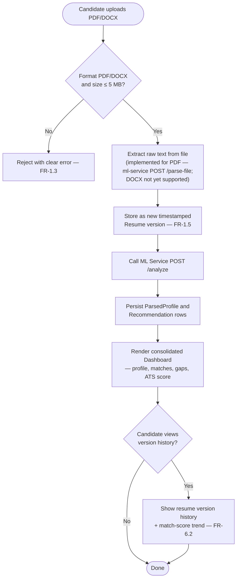
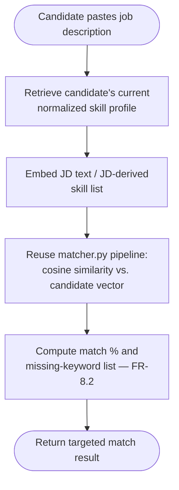
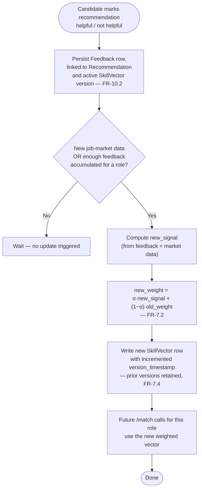

# Process Flow

Activity-diagram view of the system's three main end-to-end flows: the core analyze flow (implemented), JD matching (planned, reuses implemented pieces), and the temporal EMA skill-vector update (planned). Where [DFD](dfd.md) shows *what data moves where* and [LLD](lld.md) shows *module call sequences*, this document shows the flow from the **user's** perspective, including decision points and failure paths.

## 1. Core flow — "Analyze my resume" (implemented in `ml-service`)

```mermaid
flowchart TD
    Start([Candidate submits resume text\nor uploads a PDF]) --> Val{Valid input?}
    Val -- No --> ErrIn[Return 422/415 — validation\nor unsupported file type]
    Val -- Yes --> Extract{Uploaded a file?}
    Extract -- Yes --> ExtractText[Extract text, column-aware\n(document_extraction/pdf_extractor.py)]
    Extract -- No --> Parse
    ExtractText --> Parse[Parse: local NER model by default,\nLLM only if PARSER_BACKEND=llm]
    Parse --> ParseOK{Parse succeeded?}
    ParseOK -- No --> ErrParse["Propagate error\n(hardening: fall back gracefully — not yet implemented)"]
    ParseOK -- Yes --> Norm[Normalize extracted skills\nagainst canonical taxonomy]
    Norm --> ATS[Score ATS compatibility\n— runs independently, no LLM]
    Norm --> Embed[Embed candidate skill set]
    Embed --> Match[Rank curated roles by\ncosine similarity]
    Match --> Gap[Derive skill gaps from\nmissing_skills per role]
    ATS --> Explain
    Match --> Explain
    Gap --> Explain[Call LLM: turn scores into\ncoaching explanation]
    Explain --> ExplainOK{LLM available?}
    ExplainOK -- No --> Degrade["Return profile + ats_score + matches + gaps,\nexplanation empty/fallback\n(NFR-3.1 graceful degradation)"]
    ExplainOK -- Yes --> Assemble[Assemble AnalyzeResponse]
    Degrade --> Return
    Assemble --> Return([Return to candidate])
```

## 2. Planned flow — Resume upload → dashboard (backend + frontend, not yet built)

Text extraction itself (the `X` step below) is already implemented for PDF in `ml-service` (`POST /parse-file`, column-aware via `document_extraction/`); what's still planned is the backend wrapping it with format/size validation, versioning, persistence, and the frontend dashboard.



## 3. Planned flow — Job description matching



## 4. Planned flow — Feedback → temporal EMA skill-vector update

This is the mechanism that directly answers the "static matching" limitation the SRS calls out in comparable systems (§1.4). It runs independently of any single candidate's request.



## 5. Sequence: how flow 1 maps to real function calls

For the exact module-to-module call sequence behind flow 1 (which function calls which, in what order), see [LLD §3 Sequence diagram — POST /analyze](lld.md#3-sequence-diagram--post-analyze). This document intentionally stays at the user-journey level; that one stays at the code level.

## Related documents

- [Data Flow Diagram](dfd.md)
- [Use Case Diagram](use-case-diagram.md)
- [Low-Level Design](lld.md)
- [Database Schema](database-schema.md) — `SkillVector` table backing flow 4
