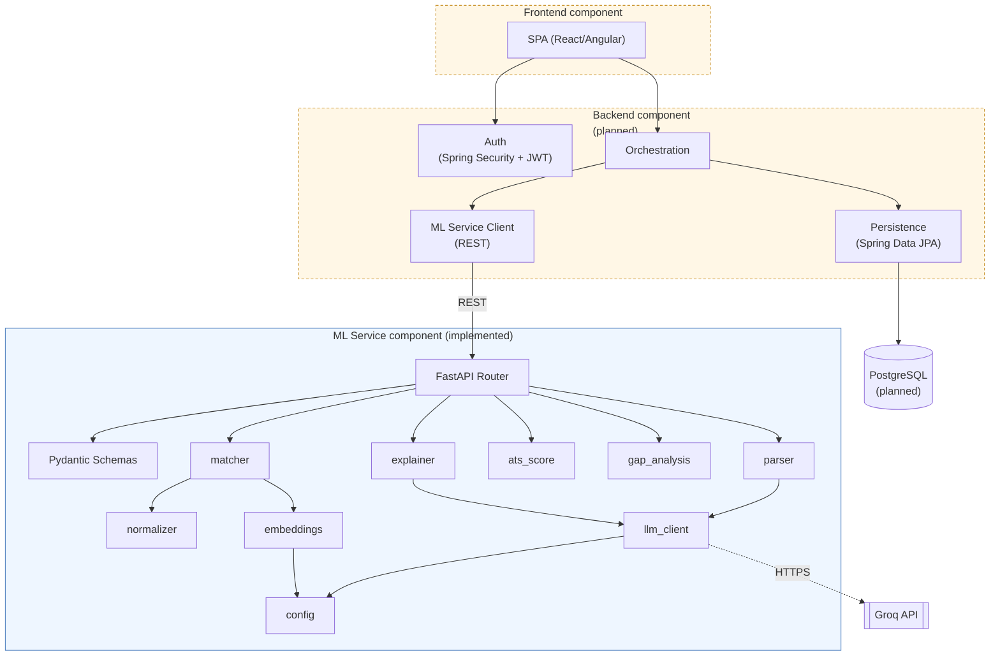

# UML Diagrams — Index

This project's UML documentation is split across focused files rather than one large one, so each diagram stays readable. This page is the index, plus the one diagram type that doesn't have a natural home elsewhere: the **component diagram**.

| Diagram type | Where | What it shows |
|---|---|---|
| Use case diagram | [use-case-diagram.md](use-case-diagram.md) | Actors, use cases, implemented vs. planned |
| Class diagram | [class-diagram.md](class-diagram.md) | Pydantic models + services (implemented), planned JPA entities |
| Entity-relationship diagram | [entity-diagram.md](entity-diagram.md) | Conceptual/logical data model |
| Sequence diagram | [lld.md §3](lld.md#3-sequence-diagram--post-analyze) | Call sequence for `POST /analyze` |
| Activity diagrams | [process-flow.md](process-flow.md) | User-journey flows with decision points |
| Component diagram | This page, §1 below | Deployable/importable units and their dependencies |
| Deployment diagram | [architecture.md §4](architecture.md#4-deployment-view-demonstration-target) | Physical/container deployment target |

## 1. Component diagram

Shows compile-time/import-time dependencies between components — a level below the architecture diagram's "boxes and network calls," a level above the class diagram's "classes and methods."

## 2. Reading order for reviewers new to the project

If you're reviewing this documentation set for the first time (e.g. for academic evaluation), the intended reading order is:

1. [Abstraction Overview](abstraction-overview.md) — the *why*
2. [System Architecture](architecture.md) — the *shape*
3. [HLD](hld.md) — layer responsibilities
4. [Use Case Diagram](use-case-diagram.md) — user-facing scope
5. [DFD](dfd.md) and [Process Flow](process-flow.md) — behavior
6. [Entity Diagram](entity-diagram.md) and [Database Schema](database-schema.md) — data model
7. [Class Diagram](class-diagram.md) and [Entities & Fields](entities-and-fields.md) — implementation-level structure
8. [LLD](lld.md) — API contracts and module-level detail, grounded in the real `ml-service/` code

## Related documents

- [Tech Stack](tech-stack.md)
- [Index](index.md)
