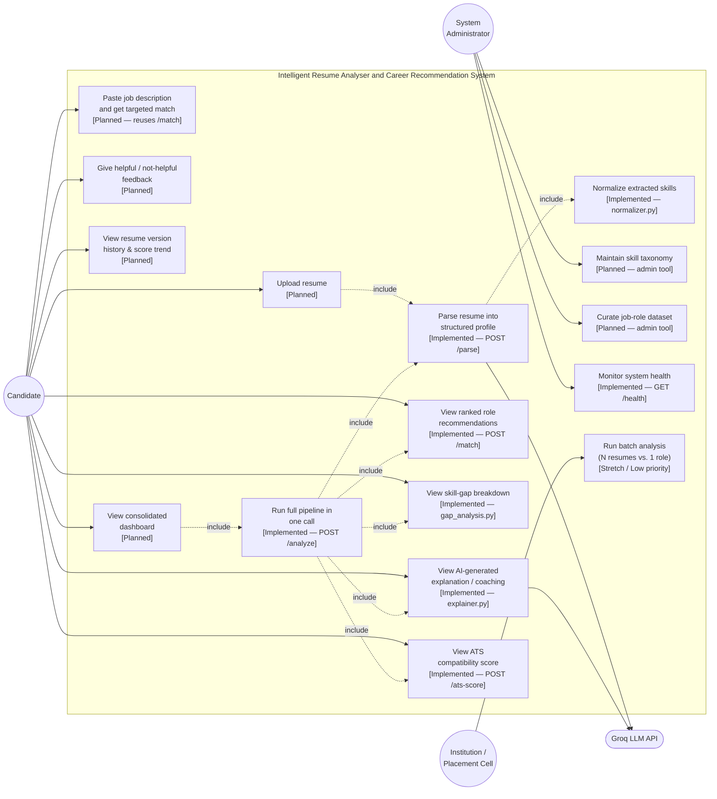

# Use Case Diagram

Actors and use cases per SRS §2.3 (User Classes) and §3 (Functional Requirements). Each use case is tagged **[Implemented]** where it exists today as a working `ml-service` endpoint, or **[Planned]** where it depends on the not-yet-built backend/frontend.

## Actors

| Actor | Description |
|---|---|
| **Candidate** (primary) | Job-seeking fresher or early-career professional (0–2 years). Assumed comfortable with standard web apps, not assumed to be technical. |
| **System Administrator** | Maintains the skill taxonomy and curated job-role dataset; monitors system health. |
| **Institution / Placement Cell** (future secondary actor) | Potential future user of a batch-analysis capability (SRS Appendix B, stretch scope) to evaluate multiple candidates against one role. |
| **Groq LLM API** (external system actor) | Invoked by the system for two use cases only — never initiates action itself. |

## Diagram

## Use case detail (primary flows)

### UC4/UC5/UC6/UC8/UC12 — "Analyze my resume" (the core, implemented flow)
- **Actor:** Candidate
- **Precondition:** Candidate has resume text available (upload/extraction handled upstream by the planned backend; the ML service itself accepts raw text today).
- **Main flow:** Candidate's resume text → `POST /analyze` → system returns structured profile, ATS score with breakdown, ranked role matches with matched/missing skills, gap list, and a plain-language explanation — in one response.
- **Postcondition:** Candidate sees results; (planned) backend persists a `Recommendation` row per matched role.
- **Related requirements:** FR-3.1–FR-3.4, FR-4.1–FR-4.3, FR-5.1–FR-5.3, FR-6.1, FR-9.1–FR-9.4.

### UC7 — "Match against a specific job description" (planned)
- **Actor:** Candidate
- **Main flow:** Candidate pastes JD free text → system reuses the same embedding pipeline (`matcher.py`) to compute a targeted match percentage and missing-keyword list, rather than matching against the curated role dataset.
- **Related requirements:** FR-8.1, FR-8.2.

### UC9 — "Give feedback on a recommendation" (planned)
- **Actor:** Candidate
- **Main flow:** Candidate marks a recommendation helpful/not-helpful → system persists `Feedback`, linked to the specific `Recommendation` and the `SkillVector` version active at the time → feeds into the next EMA update (see [Process Flow](process-flow.md) §Temporal update).
- **Related requirements:** FR-10.1, FR-10.2, FR-7.3.

### UC13/UC14 — Admin taxonomy & dataset curation (planned)
- **Actor:** System Administrator
- **Main flow:** Admin extends `skill_taxonomy.json` / `role_skills.json` (today: static files; planned: DB-backed, editable without a code deployment per FR-2.3).

## Related documents

- [Data Flow Diagram](dfd.md)
- [Process Flow](process-flow.md)
- [Low-Level Design](lld.md) — API contracts backing each implemented use case
